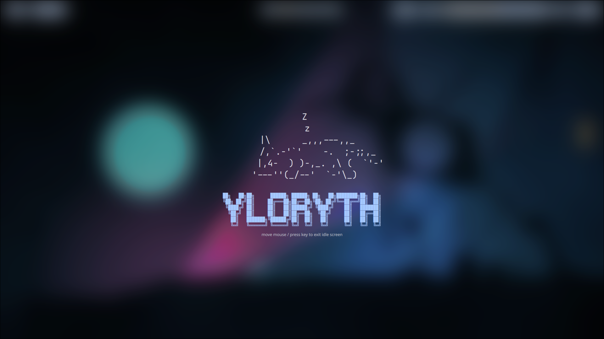
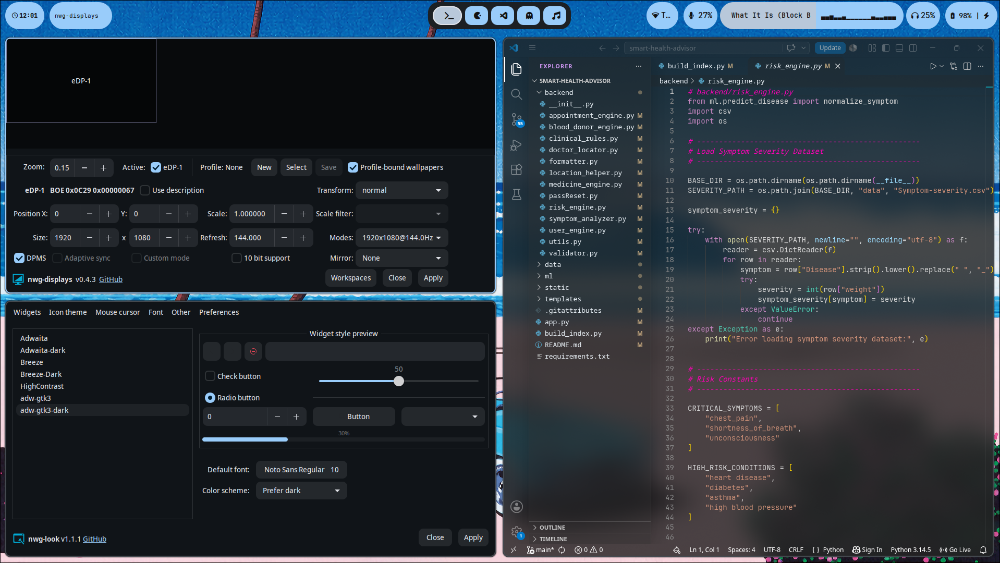
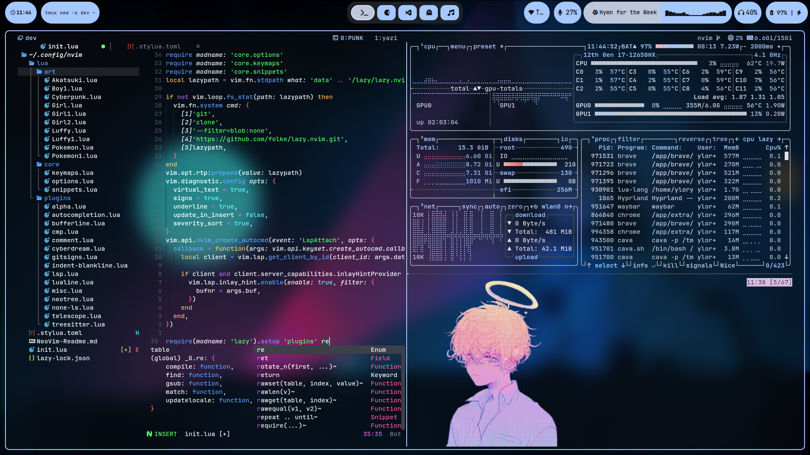
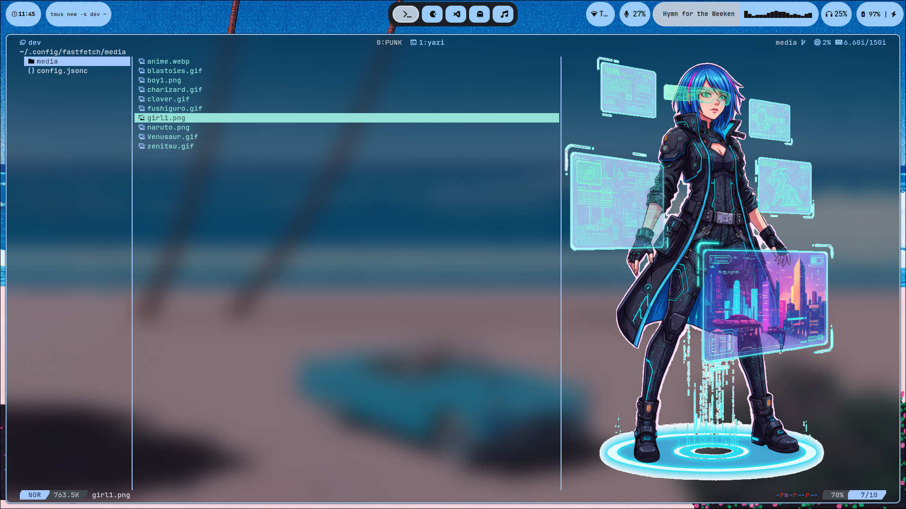

# 🎨 Hyprland Dynamic Rice

A modern Arch Linux + Hyprland setup built around dynamic wallpaper-based theming using Matugen.

Every wallpaper automatically generates a complete color palette and synchronizes the entire desktop environment including:

* Hyprland
* Waybar
* Kitty
* Fish
* Starship
* Neovim
* Tmux
* Mako
* GTK 3 / GTK 4
* Yazi
* Cava
* Quickshell

---



---
## ✨ Features

### 🎨 Dynamic Theming

Powered by Matugen.

Change a wallpaper and the entire desktop updates automatically:

* Window manager colors
* Terminal colors
* Waybar styling
* GTK applications
* Notifications
* Editor themes
* File manager colors
* Shell prompt colors

---

### 🖥️ Hyprland

* Multi-monitor support
* Custom workspaces
* Hyprlock integration
* Hypridle power management
* Dynamic wallpaper switching

---

### 📊 Waybar

Custom modules including:

* Cava audio visualizer
* MPRIS media controls
* Battery information
* Power menu
* Dynamic Matugen colors

---

### 🐟 Terminal Workflow

* Kitty
* Fish shell
* Starship prompt
* Tmux
* Fastfetch

Built for development and terminal-first workflows.

---

### 📝 Editor

Neovim configuration includes:

* LSP support
* Treesitter
* Telescope
* Neo-tree
* Autocompletion
* Git integration
* Dashboard

---

### 📂 File Management

* Yazi
* Dynamic Matugen colors
* Preview support

---

## 📸 Screenshots

### Idle Desktop


### GTK + VSCode



### Neovim + Tmux



### Yazi



---

## 🎥 Showcase

See the complete setup in action:

[Showcase Video](assets/ShowCase.mp4)

---

## 📁 Repository Structure

```text
.
├── hypr
├── waybar
├── rofi
├── kitty
├── fish
├── nvim
├── tmux
├── mako
├── matugen
├── quickshell
├── yazi
├── gtk
├── fastfetch
├── cava
└── assets
```

---

## 🎨 Wallpaper Theme Switching

The setup uses a custom wallpaper script.

Example:

```bash
walset 1.jpg
```

This will:

1. Apply wallpaper
2. Generate Matugen palette
3. Update GTK colors
4. Update Waybar colors
5. Update Kitty theme
6. Update Neovim colors
7. Update Yazi colors
8. Update Tmux colors
9. Update Hyprlock wallpaper
10. Send desktop notification

---

## 📦 Dependencies

Core packages:

```bash
hyprland
hyprpaper
hyprlock
hypridle
waybar
rofi
kitty
fish
starship
mako
matugen
quickshell
neovim
tmux
yazi
cava
fastfetch
wl-clipboard
grim
slurp
```

---
git
## 🚀 Installation

Clone the repository:

```bash
git clone https://github.com/Yugal006/Arch-Hyprland-dotfiles.git
cd hyprland-dotfiles
```

Copy the configurations:

```bash
cp -r hypr ~/.config/
cp -r waybar ~/.config/
cp -r kitty ~/.config/
cp -r fish ~/.config/
cp -r nvim ~/.config/
```

Install the required packages and restart Hyprland.

---

## ⚠️ Notes

This setup is designed for:

* Arch Linux
* Hyprland
* Wayland

Other distributions may require package name adjustments.

---

## 🙏 Credits

Inspired by the amazing Linux ricing and Unix customization communities.

Special thanks to:

[@saneaspect](https://github.com/saneaspect)

---

⭐ If you like this setup, consider starring the repository.